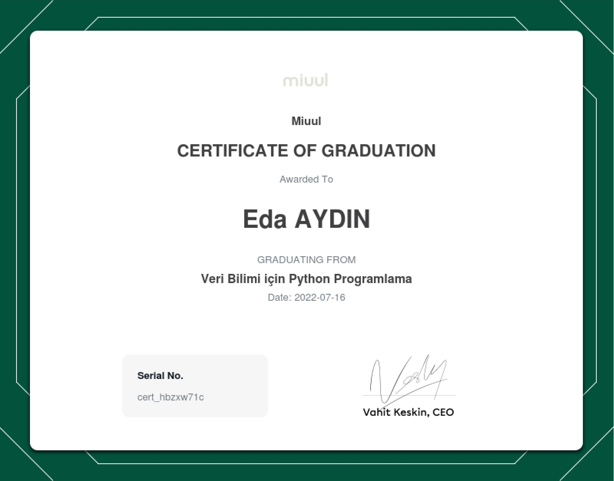
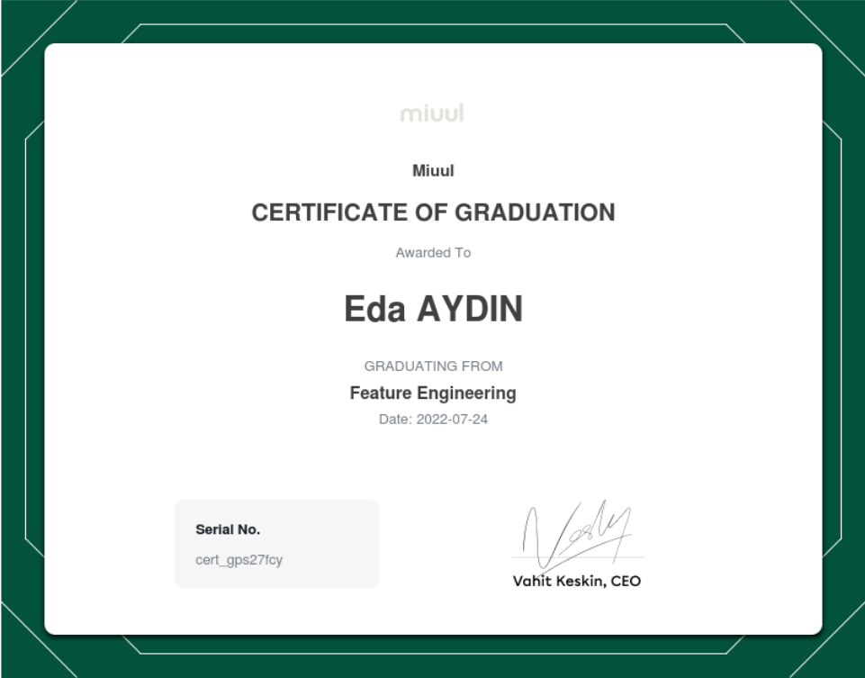
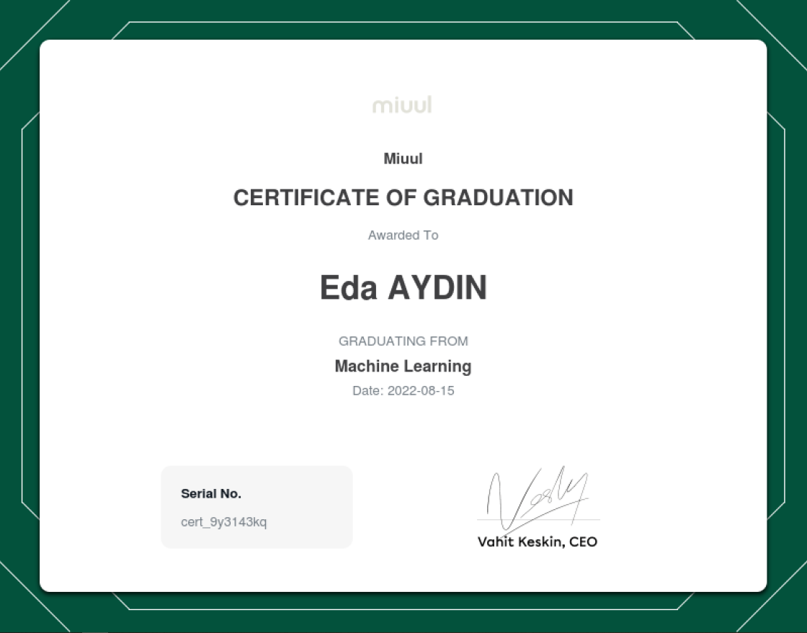

# Miuul Machine Learning Summer Bootcamp

This repo includes projects and assignments made within the Machine Learning Summer Bootcamp.

### Program Objectives

The free summer camp, which will be organized for undergraduate or graduate students without any income, will be held
with the hybrid education model of Miuul. All the development stages of a machine learning project will be explained in
this camp, where participants will be provided with the support of mentors who have experience in different national and
international companies, as well as access to the materials to be presented within the scope of the learning process.

### Program courses

- **_Python Programming_**
  - _Module 1_ (July 1 - 7, 2022)
    - Important Lecture Notes
      - [Alternating Enumerate](https://github.com/edaaydinea/Miuul-Machine-Learning-Summer-Bootcamp/blob/main/Module%201/alternating_enumerate.py)
      - [Create dictionary with dataframe](https://github.com/edaaydinea/Miuul-Machine-Learning-Summer-Bootcamp/blob/main/Module%201/create_dictionary.py)
      - Exercises related to dataframe
        - [1](https://github.com/edaaydinea/Miuul-Machine-Learning-Summer-Bootcamp/blob/main/Module%201/change_names.py)
        - [2](https://github.com/edaaydinea/Miuul-Machine-Learning-Summer-Bootcamp/blob/main/Module%201/change_names2.py)
      - Interview Questions
        - [1](https://github.com/edaaydinea/Miuul-Machine-Learning-Summer-Bootcamp/blob/main/Module%201/interview_question.py)
        - [2](https://github.com/edaaydinea/Miuul-Machine-Learning-Summer-Bootcamp/blob/main/Module%201/interview_question2.py)
        - [3](https://github.com/edaaydinea/Miuul-Machine-Learning-Summer-Bootcamp/blob/main/Module%201/interview_question3.py)
    - [Project Solution](https://github.com/edaaydinea/Miuul-Machine-Learning-Summer-Bootcamp/blob/main/Module%201/homework1.py)
  - _Module 2_ (July 12 - 17, 2022)
    - [01 - Data Analysis with Python - NumPy](https://github.com/edaaydinea/Miuul-Machine-Learning-Summer-Bootcamp/blob/58c70bbff0821c0df160aebe21689df238611ea9/Module%202/01%20-%20Data%20Analysis%20with%20Python%20-%20NumPy)
    - [02 - Data Analysis with Python - Pandas](https://github.com/edaaydinea/Miuul-Machine-Learning-Summer-Bootcamp/blob/58c70bbff0821c0df160aebe21689df238611ea9/Module%202/02%20-%20Data%20Analysis%20with%20Python%20-%20Pandas)
    - [03 - Data Analysis with Python - Data Visualization](https://github.com/edaaydinea/Miuul-Machine-Learning-Summer-Bootcamp/blob/58c70bbff0821c0df160aebe21689df238611ea9/Module%202/03%20-%20Data%20Analysis%20with%20Python%20-%20Data%20Visualization)
    - [04 - Advanced Function EDA](https://github.com/edaaydinea/Miuul-Machine-Learning-Summer-Bootcamp/blob/58c70bbff0821c0df160aebe21689df238611ea9/Module%202/04%20-%20Advanced%20Functional%20EDA)
    - 05 - Exercises
      - [Adding Features and Docstring to Functions](https://github.com/edaaydinea/Miuul-Machine-Learning-Summer-Bootcamp/blob/58c70bbff0821c0df160aebe21689df238611ea9/Module%202/05%20-%20Exercises/Adding%20Features%20and%20DocString%20to%20Functions.ipynb)
      - [Pandas Exercises](https://github.com/edaaydinea/Miuul-Machine-Learning-Summer-Bootcamp/blob/58c70bbff0821c0df160aebe21689df238611ea9/Module%202/05%20-%20Exercises/Pandas%20Exercises.ipynb)
      - [Capstone Project - 1: Rule-Based Classification](https://github.com/edaaydinea/Miuul-Machine-Learning-Summer-Bootcamp/blob/main/Module%202/05%20-%20Exercises/Capstone%20Project%201%20-%20Calculating%20Potential%20Customer%20Yield%20with%20Rule-Based%20Classification.ipynb)
- **_Feature Engineering_** (July 18 - 24, 2022)
  - Lecture Notes
    - [01 - Outliers](https://github.com/edaaydinea/Miuul-Machine-Learning-Summer-Bootcamp/blob/ca797061e0f8751da8c8709f96a6f4d89f736627/Module%203/01%20-%20Outliers.ipynb)
    - [02 - Missing Values](https://github.com/edaaydinea/Miuul-Machine-Learning-Summer-Bootcamp/blob/ca797061e0f8751da8c8709f96a6f4d89f736627/Module%203/02%20-%20Missing%20Values.ipynb)
      - [03 - Encoding Scaling](https://github.com/edaaydinea/Miuul-Machine-Learning-Summer-Bootcamp/blob/ca797061e0f8751da8c8709f96a6f4d89f736627/Module%203/03%20-%20Encoding%20Scaling.ipynb)
      - [04 - Feature Extraction](https://github.com/edaaydinea/Miuul-Machine-Learning-Summer-Bootcamp/blob/ca797061e0f8751da8c8709f96a6f4d89f736627/Module%203/04%20-%20Feature%20Extraction.ipynb)
      - [05 - Application](https://github.com/edaaydinea/Miuul-Machine-Learning-Summer-Bootcamp/blob/ca797061e0f8751da8c8709f96a6f4d89f736627/Module%203/05%20-%20Application.ipynb)
    - Capstone Projects
      - [Capstone Project - 2 : Diabetes Feature Engineering](https://github.com/edaaydinea/Miuul-Machine-Learning-Summer-Bootcamp/blob/main/Module%203/Capstone%20Project%202%20-%20Diabetes%20Feature%20Engineering/Capstone%20Project%202%20-%20Diabetes%20Feature%20Engineering.ipynb)
      - [Capstone Project - 3 : Telco Customer Churn Feature Engineering](Module%203/Capstone%20Project%203%20-%20Telco%20Customer%20Churn%20Feature%20Engineering/Capstone%20Project%203%20-%20Telco%20Customer%20Churn%20Feature%20Engineering.ipynb)

- **_Machine Learning - Module 1_** (July 25 - 31, 2022)
  - Lecture Notes
    - **Introduction to Machine Learning**
      - [01 - Basic Concepts](Module%204/01%20-%20Basic%20Concepts.ipynb)
    - **Linear Regression**
      - [02 - Linear Regression](Module%204/02%20-%20Linear%20Regression.ipynb)
    - **Logistic Regression**
      - [03 - Logistic Regression](Module%204/03%20-%20Logistic%20Regression.ipynb)
  - Capstone Projects
    - [Capstone Project - 4 : Baseball Salary Prediction with Machine Learning](Module%204/Capstone%20Project%204%20-%20Salary%20Prediction%20in%20Machine%20Learning.ipynb)

- **_Machine Learning - Module 2_** (August 1 - 7,2022)
  - Lecture Notes
    - **KNN**
      - [KNN](https://github.com/edaaydinea/Miuul-Machine-Learning-Summer-Bootcamp/blob/8172641675d70a3542de36d040accf41581abd81/Module%205/KNN.ipynb)
    - **Classification and Regression Tree (CART)**
      - [CART](https://github.com/edaaydinea/Miuul-Machine-Learning-Summer-Bootcamp/blob/8172641675d70a3542de36d040accf41581abd81/Module%205/CART.ipynb)
    - **Advanced Tree Methods**
      - [Advanced Tree Methods](https://github.com/edaaydinea/Miuul-Machine-Learning-Summer-Bootcamp/blob/8172641675d70a3542de36d040accf41581abd81/Module%205/Advanced%20Tree%20Methods.ipynb)
    - **Imbalanced Datasets**
      - [Imbalanced Datasets](https://github.com/edaaydinea/Miuul-Machine-Learning-Summer-Bootcamp/blob/8172641675d70a3542de36d040accf41581abd81/Module%205/Dengesiz-Veri-Seti.ipynb)
  - Capstone Projects
    - [Capstone Project - 5 : Creating a House Price Prediction Model](https://github.com/edaaydinea/Miuul-Machine-Learning-Summer-Bootcamp/blob/main/Module%205/Capstone%20Project%20-%205%20-%20Creating%20a%20House%20Price%20Prediction%20Model/Capstone%20Project%205%20-%20Creating%20a%20House%20Price%20Prediction%20Model.ipynb)
    - [Capstone Project - 6 : Creating a Customer Churn Prediction Model](https://github.com/edaaydinea/Miuul-Machine-Learning-Summer-Bootcamp/blob/main/Module%205/Capstone%20Project%20-%206%20-%20Creating%20a%20Customer%20Churn%20Prediction%20Model/Capstone%20Project%20-%206%20-%20Creating%20a%20Customer%20Churn%20Prediction%20Model.ipynb)

- **_Machine Learning - Module 3_** (August 8 - 14, 2022)
  - Lecture Notes
    - Unsupervised Learning
      - [Unsupervised Learning](https://github.com/edaaydinea/Miuul-Machine-Learning-Summer-Bootcamp/blob/main/Module%206/Unsupervised%20Learning/Unsupervised%20Learning.ipynb)
    - Machine Learning Pipeline
      - [Machine Learning Pipeline](https://github.com/edaaydinea/Miuul-Machine-Learning-Summer-Bootcamp/blob/main/Module%206/Machine%20Learning%20Pipeline/End%20to%20End%20Diabetes%20Machine%20Learning%20Pipeline.ipynb)
  - Capstone Projects
    - [Capstone Project - 7: Customer Segmentation with K-Means](https://github.com/edaaydinea/Miuul-Machine-Learning-Summer-Bootcamp/blob/main/Module%206/Capstone%20Project%206%20-%20Customer%20Segmentation%20with%20K-Means/Customer%20Segmentation%20with%20K-Means.ipynb)

### Program projects

- [Capstone Project - 1 :Calculating Potential Customer Yield with Rule-Based Classification](https://github.com/edaaydinea/Miuul-Machine-Learning-Summer-Bootcamp/blob/main/Module%202/05%20-%20Exercises/Capstone%20Project%201%20-%20Calculating%20Potential%20Customer%20Yield%20with%20Rule-Based%20Classification.ipynb)
- [Capstone Project - 2 : Diabetes Feature Engineering](https://github.com/edaaydinea/Miuul-Machine-Learning-Summer-Bootcamp/blob/main/Module%203/Capstone%20Project%202%20-%20Diabetes%20Feature%20Engineering/Capstone%20Project%202%20-%20Diabetes%20Feature%20Engineering.ipynb)
- [Capstone Project - 3 : Telco Customer Churn Feature Engineering](https://github.com/edaaydinea/Miuul-Machine-Learning-Summer-Bootcamp/blob/main/Module%203/Capstone%20Project%203%20-%20Telco%20Customer%20Churn%20Feature%20Engineering/Capstone%20Project%203%20-%20Telco%20Customer%20Churn%20Feature%20Engineering.ipynb)
- [Capstone Project - 4 : Baseball Salary Prediction with Machine Learning](https://github.com/edaaydinea/Miuul-Machine-Learning-Summer-Bootcamp/blob/main/Module%204/Capstone%20Project%204%20-%20Salary%20Prediction%20in%20Machine%20Learning.ipynb)
- [Capstone Project - 5 : Creating a House Price Prediction Model](https://github.com/edaaydinea/Miuul-Machine-Learning-Summer-Bootcamp/blob/main/Module%205/Capstone%20Project%20-%205%20-%20Creating%20a%20House%20Price%20Prediction%20Model/Capstone%20Project%205%20-%20Creating%20a%20House%20Price%20Prediction%20Model.ipynb)
- [Capstone Project - 6 : Creating a Customer Churn Prediction Model](https://github.com/edaaydinea/Miuul-Machine-Learning-Summer-Bootcamp/blob/main/Module%205/Capstone%20Project%20-%206%20-%20Creating%20a%20Customer%20Churn%20Prediction%20Model/Capstone%20Project%20-%206%20-%20Creating%20a%20Customer%20Churn%20Prediction%20Model.ipynb)
- [Capstone Project - 7 : Customer Segmentation with K-Means](https://github.com/edaaydinea/Miuul-Machine-Learning-Summer-Bootcamp/blob/main/Module%206/Capstone%20Project%206%20-%20Customer%20Segmentation%20with%20K-Means/Customer%20Segmentation%20with%20K-Means.ipynb)

### Program Certificates

- 
- 
- 
