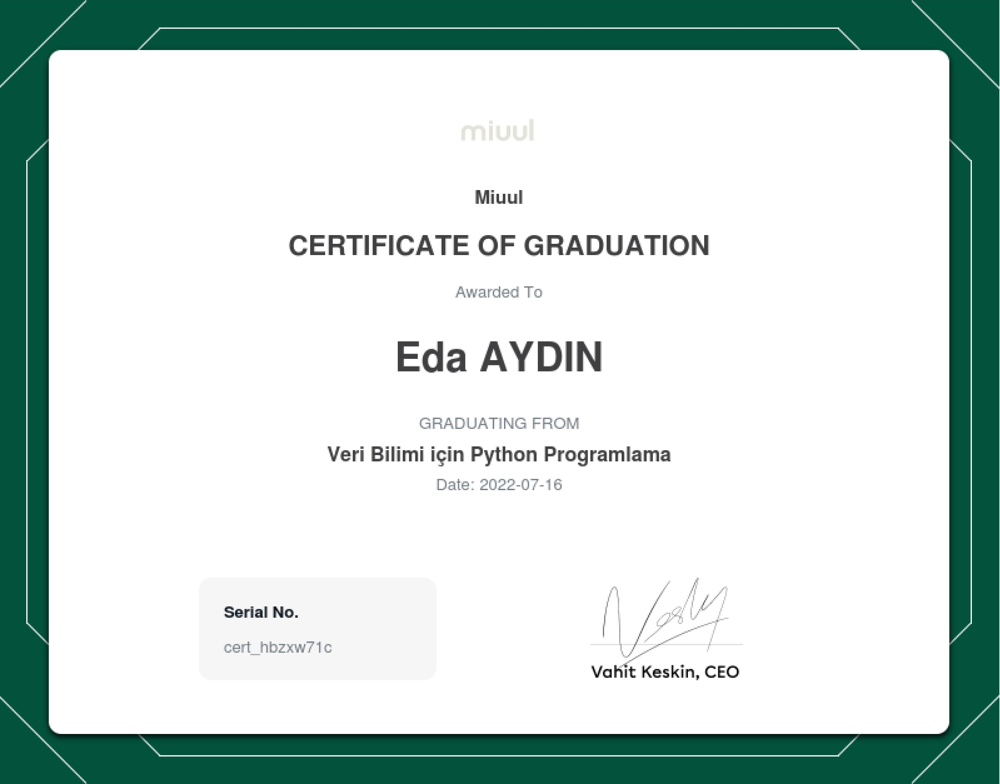

# Miuul Machine Learning Summer Bootcamp

This repo includes projects and assignments made within the Machine Learning Summer Bootcamp.

### Program objectives

The free summer camp, which will be organized for undergraduate or graduate students without any income, will be held
with the hybrid education model of Miuul. All the development stages of a machine learning project will be explained in
this camp, where participants will be provided with the support of mentors who have experience in different national and
international companies, as well as access to the materials to be presented within the scope of the learning process.

### Program courses

- **_Python Programming_**
    - _Module 1_ (July 1 - 7, 2022)
        - Important Lecture Notes
            - [Alternating Enumerate](https://github.com/edaaydinea/Miuul-Machine-Learning-Summer-Bootcamp/blob/main/Module%201/alternating_enumerate.py)
            - [Create dictionary with dataframe](https://github.com/edaaydinea/Miuul-Machine-Learning-Summer-Bootcamp/blob/main/Module%201/create_dictionary.py)
            - Exercises related to dataframe
                - [1](https://github.com/edaaydinea/Miuul-Machine-Learning-Summer-Bootcamp/blob/main/Module%201/change_names.py)
                - [2](https://github.com/edaaydinea/Miuul-Machine-Learning-Summer-Bootcamp/blob/main/Module%201/change_names2.py)
            - Interview Questions
                - [1](https://github.com/edaaydinea/Miuul-Machine-Learning-Summer-Bootcamp/blob/main/Module%201/interview_question.py)
                - [2](https://github.com/edaaydinea/Miuul-Machine-Learning-Summer-Bootcamp/blob/main/Module%201/interview_question2.py)
                - [3](https://github.com/edaaydinea/Miuul-Machine-Learning-Summer-Bootcamp/blob/main/Module%201/interview_question3.py)
        - [Project Solution](https://github.com/edaaydinea/Miuul-Machine-Learning-Summer-Bootcamp/blob/main/Module%201/homework1.py)
    - _Module 2_ (July 12 - 17, 2022)
        - [01 - Data Analysis with Python - NumPy](https://github.com/edaaydinea/Miuul-Machine-Learning-Summer-Bootcamp/blob/58c70bbff0821c0df160aebe21689df238611ea9/Module%202/01%20-%20Data%20Analysis%20with%20Python%20-%20NumPy)
        - [02 - Data Analysis with Python - Pandas](https://github.com/edaaydinea/Miuul-Machine-Learning-Summer-Bootcamp/blob/58c70bbff0821c0df160aebe21689df238611ea9/Module%202/02%20-%20Data%20Analysis%20with%20Python%20-%20Pandas)
        - [03 - Data Analysis with Python - Data Visualization](https://github.com/edaaydinea/Miuul-Machine-Learning-Summer-Bootcamp/blob/58c70bbff0821c0df160aebe21689df238611ea9/Module%202/03%20-%20Data%20Analysis%20with%20Python%20-%20Data%20Visualization)
        - [04 - Advanced Function EDA](https://github.com/edaaydinea/Miuul-Machine-Learning-Summer-Bootcamp/blob/58c70bbff0821c0df160aebe21689df238611ea9/Module%202/04%20-%20Advanced%20Functional%20EDA)
        - 05 - Exercises
            - [Adding Features and Docstring to Functions](https://github.com/edaaydinea/Miuul-Machine-Learning-Summer-Bootcamp/blob/58c70bbff0821c0df160aebe21689df238611ea9/Module%202/05%20-%20Exercises/Adding%20Features%20and%20DocString%20to%20Functions.ipynb)
            - [Pandas Exercises](https://github.com/edaaydinea/Miuul-Machine-Learning-Summer-Bootcamp/blob/58c70bbff0821c0df160aebe21689df238611ea9/Module%202/05%20-%20Exercises/Pandas%20Exercises.ipynb)
            - [Project: Rule-Based Classification](https://github.com/edaaydinea/Miuul-Machine-Learning-Summer-Bootcamp/blob/58c70bbff0821c0df160aebe21689df238611ea9/Module%202/05%20-%20Exercises/Rule-Based%20Classification.ipynb)
- **_Feature Engineering_** (July 18 - 24, 2022)
- **_Introduction to Machine Learning_**
- **_Regression Problems_**
- **_Classification Problems_**
- **_Advanced Tree Methods_**
- **_Unsupervised Learning_**
- **_Machine Learning Pipeline_**

### Program projects

- [Lead Calculation with Rule-Based Classification](https://github.com/edaaydinea/Miuul-Machine-Learning-Summer-Bootcamp/blob/58c70bbff0821c0df160aebe21689df238611ea9/Module%202/05%20-%20Exercises/Rule-Based%20Classification.ipynb)

### Program Certificates

- 